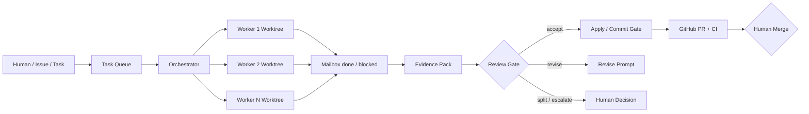

# Codex Agent Superteam

<div align="center">

<p>
  
  
  
</p>

<p>
  <a href="#english">English</a> ·
  <a href="#中文速览">中文速览</a> ·
  <a href="#quick-start">Quick Start</a> ·
  <a href="#multi-agent-orchestration-v04">Multi-Agent</a> ·
  <a href="#github-and-ci-gates">GitHub Gates</a>
</p>

**A local-first, evidence-driven framework for running Codex like a bounded agent team.**

Turn a loose coding request into scoped worker prompts, isolated worktrees, process logs, review evidence, GitHub PRs, CI gates, and a final human decision.

</div>

---

## English

Codex Agent Superteam is a reusable template for supervised automation on large codebases. It gives Codex a repeatable operating loop without giving it unchecked merge authority.

```text
Task → Scope → Worker Prompt → Codex Runner → Mailbox Signal → Evidence Pack → Review Gate → PR/CI Gate → Human Decision
```

### Why It Exists

Large projects need automation, but they also need proof. This framework makes every worker action auditable through files on disk: diffs, changed file lists, risk summaries, validation output, review decisions, process logs, and final reports.

### What It Provides

| Capability | What it does | Human gate |
|---|---|---|
| 🧭 Task queue | Converts work into pending/active/done task files with allowed and forbidden paths | Scope expansion |
| 🤖 Bounded workers | Generates Codex worker prompts with ownership, stop rules, and mailbox completion files | Ambiguous requirements |
| 🌳 Worktree isolation | Runs workers in separate Git worktrees and branches | Apply back to main project |
| ⚡ v0.4 runner | Starts multiple worker processes, captures stdout/stderr, exit code, duration, and failure state | Accept / apply / merge |
| 🧾 Evidence gates | Generates changed files, patches, scope checks, risk reports, validation records, and reviews | Risk override |
| 🐙 GitHub layer | Creates PR bodies, draft PRs, CI watch evidence, and PR acceptance checks through `gh` | PR merge |
| 🔐 Privacy gate | Scans tracked files for local paths, tokens, private email, and local run artifacts | Release approval |

## Architecture



## Installation

Install from a Git repository:

```bash
git clone https://github.com/<owner>/<repo>.git
cd <repo>
python3 -m pip install -e .
agent-loop --help
```

Or run directly from source:

```bash
python3 -m agent_loop.cli --help
```

## Quick Start

Point the tool at any Git project:

```bash
export PROJECT_ROOT="/path/to/project"
agent-loop init --root "$PROJECT_ROOT"
agent-loop doctor --root "$PROJECT_ROOT"
```

Create a scoped task:

```bash
agent-loop new-task "Add login validation" \
  --root "$PROJECT_ROOT" \
  --allowed 'src/auth/**' \
  --forbidden 'infra/**' \
  --validation 'python3 -m pytest -q'
```

Run one worker manually:

```bash
RUN_ID=$(agent-loop run-next --root "$PROJECT_ROOT" | awk '{print $2}')
agent-loop dispatch "$RUN_ID" --root "$PROJECT_ROOT" --agent-id worker-auth --codex-command
agent-loop run-codex "$RUN_ID" --root "$PROJECT_ROOT" --agent-id worker-auth --dry-run
agent-loop watch "$RUN_ID" --root "$PROJECT_ROOT" --agent-id worker-auth --timeout 300
agent-loop report "$RUN_ID" --root "$PROJECT_ROOT"
```

## Multi-Agent Orchestration v0.4

Run several bounded workers at once while keeping every final decision human-controlled:

```bash
agent-loop orchestrate \
  --root "$PROJECT_ROOT" \
  --parallel 3 \
  --worktree \
  --run-codex \
  --watch \
  --timeout 1800
```

For deterministic tests or custom worker wrappers, use `--run-command`:

```bash
agent-loop orchestrate \
  --root "$PROJECT_ROOT" \
  --parallel 2 \
  --run-command 'python3 scripts/fake_worker.py' \
  --watch
```

The v0.4 orchestrator writes:

```text
.agent-loop/orchestrate-result.yaml
.agent-loop/orchestrate-report.md
.agent-runs/<run-id>/orchestrate-worker.yaml
.agent-runs/<run-id>/worker.stdout.log
.agent-runs/<run-id>/worker.stderr.log
```

Each worker evidence records `agent_id`, `run_id`, `task_id`, `worktree_path`, `branch`, `pid`, `exit_code`, `duration_seconds`, log paths, status, and failure reason when present.

### Conflict Policy

The orchestrator uses conservative path ownership checks. These can run in parallel:

```text
docs/a/**
docs/b/**
```

These are blocked from running together:

```text
docs/**
docs/api/**
```

A blocked task is recorded in `.agent-loop/orchestrate-report.md`; it is not silently dropped.

## Worktree Merge Gate

A worktree run must pass a full evidence chain before it can be applied or committed:

```bash
agent-loop worktree-collect "$RUN_ID" --root "$PROJECT_ROOT" --agent-id worker-docs
agent-loop merge-preflight "$RUN_ID" --root "$PROJECT_ROOT" --agent-id worker-docs
agent-loop worktree-preview "$RUN_ID" --root "$PROJECT_ROOT" --agent-id worker-docs
agent-loop review-accept "$RUN_ID" --root "$PROJECT_ROOT" --agent-id worker-docs
agent-loop worktree-apply "$RUN_ID" --root "$PROJECT_ROOT" --agent-id worker-docs
agent-loop accept "$RUN_ID" --root "$PROJECT_ROOT" --commit
```

Required merge evidence:

```text
.agent-runs/<run-id>/
  worktrees.yaml
  worktree-collect.yaml
  merge-preflight.yaml
  changed-files.txt
  diff-stat.txt
  diff.patch
  scope-check.yaml
  risk.yaml
  validation.yaml
  review.md
  review-decision.yaml
  post-apply-diff.patch
  merge-result.yaml
  mailbox/<agent-id>.done.md
```

## GitHub and CI Gates

Use GitHub as the remote diff, review, and debugging layer:

```bash
agent-loop github-doctor --root "$PROJECT_ROOT"
agent-loop github-pr-body "$RUN_ID" --root "$PROJECT_ROOT"
agent-loop github-pr-create "$RUN_ID" --root "$PROJECT_ROOT" --draft
agent-loop github-ci-watch --root "$PROJECT_ROOT" --timeout 600 --poll 10
agent-loop github-pr-check "$RUN_ID" --root "$PROJECT_ROOT"
```

The framework does **not** auto-merge PRs. GitHub remains the human review surface: Files changed, commits, checks, comments, blame, compare, and revert.

## Recoverability and Reports

Inspect or safely resume interrupted runs:

```bash
agent-loop state "$RUN_ID" --root "$PROJECT_ROOT"
agent-loop resume "$RUN_ID" --root "$PROJECT_ROOT"
agent-loop report "$RUN_ID" --root "$PROJECT_ROOT"
```

`resume` only performs safe mechanical steps. It does not run `review-accept`, `worktree-apply`, `accept`, or PR merge.

## Configuration

Optional project config lives at `.agent-loop/config.yaml`:

```yaml
agents:
  default_agent_id: worker-1
  max_parallel: 2
validation:
  default_commands:
    - python3 -m pytest -q
risk:
  low_files: 3
  low_lines: 150
  medium_files: 8
  medium_lines: 500
git:
  branch_prefix: codex/
  require_clean_worktree: true
github:
  draft_pr: true
  require_ci_success: true
privacy:
  enabled: true
```

Priority order: CLI arguments → project config → built-in defaults.

## Safety Model

Automated:

- task/run artifact creation
- bounded prompt generation
- worker process launch and log capture
- mailbox detection
- diff, scope, risk, validation, and review evidence
- GitHub PR body and CI evidence generation

Human-controlled:

- scope expansion
- high-risk patch override
- review acceptance
- worktree apply
- commit acceptance
- GitHub PR merge

## Privacy and Release Checks

Before publishing or creating a release:

```bash
agent-loop privacy-scan --root .
agent-loop release-check --root .
python3 -m pytest -q
```

The default privacy gate scans tracked files for local machine paths, token-like strings, private email patterns, and accidental local run artifacts such as `.agent-runs/`, `.tasks/`, or `.locks/`.

## 中文速览

Codex Agent Superteam 是一个“本地优先、证据驱动、人类把关”的 Codex 多 Agent 自动化框架。它不是让 AI 直接合并代码，而是把任务拆成有边界的 worker，在独立 worktree 中运行，收集 diff、scope、risk、validation、review、日志和最终报告，再交给人类决定是否接受。

核心流程：

```text
任务 → 范围约束 → Worker Prompt → Codex 执行 → mailbox 信号 → 验收证据包 → Review → GitHub PR/CI → 人类决定
```

常用命令：

```bash
agent-loop init --root "$PROJECT_ROOT"
agent-loop new-task "Add docs" --root "$PROJECT_ROOT" --allowed 'docs/**'
agent-loop orchestrate --root "$PROJECT_ROOT" --parallel 3 --worktree --run-codex --watch
agent-loop report "$RUN_ID" --root "$PROJECT_ROOT"
agent-loop github-pr-create "$RUN_ID" --root "$PROJECT_ROOT" --draft
```

系统会自动做机械步骤，但不会自动越过这些人类关口：扩大 scope、接受高风险 patch、`worktree-apply`、`accept --commit`、GitHub merge。

## Maturity Roadmap

See `docs/roadmap.md` for release maturity, v0.4 acceptance criteria, and future work.

## Project Files

- `agent_loop/`: CLI and automation engine.
- `protocols/`: worker and coding baseline protocols.
- `templates/`: reusable task, review, and status templates.
- `docs/system-architecture.md`: architecture and operating model.
- `docs/runtime-protocol.md`: task runtime loop.
- `docs/roadmap.md`: maturity roadmap.
- `.github/workflows/test.yml`: CI gate for tests and privacy scan.

## Status

The project is an early but executable automation framework. Recommended use: supervised local automation with explicit evidence review, followed by human-controlled GitHub merge decisions.
